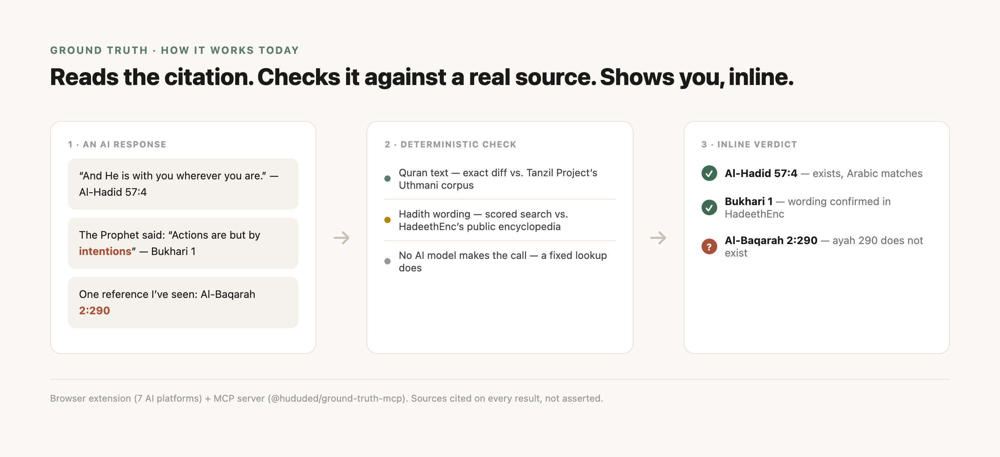

# Ground Truth

Checks whether an AI actually got your Quran or hadith citation right: does the reference exist, and does any quoted text match the real source. The name is a wink at the machine-learning term for the verified-correct answer - the discipline underneath it is tabayyun (Quran 49:6): verify the claim, especially the confident one.

**Status:** early working prototype (check `extension/manifest.json` for the current version - status notes here go stale fast, the manifest doesn't). Submitted to the Chrome Web Store, currently in developer-account verification - load unpacked for now, see Usage below.

## Usage

**Browser extension - not on the Chrome Web Store yet.** It's submitted and currently in developer-account verification, not a placeholder "coming soon" - this section gets a real store link the moment it clears. Until then, load it unpacked (takes under a minute, no build step): clone this repo, go to `chrome://extensions`, toggle Developer mode on, click "Load unpacked," select this repo's `extension/` folder. Full instructions and the current file list are in `extension/README.md`.

**MCP server - already live on npm today**, no waiting: `npx -y @hududed/ground-truth-mcp`, or add it to Claude Desktop/Claude Code per `mcp-server/README.md`. This is the fastest way to try the citation checks right now, extension or not.

## What it does

- **Reference validity** - catches citations that don't exist (e.g. "Quran 2:290" when Al-Baqarah only has 286 ayat).
- **Arabic exact-match** - if Arabic text is quoted alongside a Quran citation, diffs it (diacritic-insensitive) against the real Tanzil Uthmani text.
- **Hadith wording check** - if a hadith's wording is quoted nearby, checks that exact phrase against HadeethEnc's public Hadith Encyclopedia (a real, live lookup - the one network call this project makes, see `PRIVACY.md`).
- **Does not** yet confirm a specific hadith collection+number reference (e.g. "is this really Bukhari #1234") - that needs sunnah.com/dorar.net access, not yet granted. Does not judge tafsir or fiqh, does not auto-score an English paraphrase (no single translation is canonical, so that would be a fabricated judgment).

## Roadmap

v1 ships two checks today, both already working in the extension: does the Quran reference actually exist, and does any quoted Arabic match the real text.

Hadith checking is half-built: if a hadith's wording is quoted, that phrase gets checked live against HadeethEnc's public encyclopedia today. What's still missing is confirming a specific collection-and-number reference (is this really Bukhari's hadith #1234) - that needs sunnah.com/dorar.net's own numbering data, which access has been requested for but not yet granted.

Past that, everything sits in v2+, and it's gated behind something no amount of engineering can substitute for: hasan/da'if grading nuance, fiqh rulings, tafsir or interpretation, isnad/rijal chain authentication, and fatwa-humility scoring all require a named, qualified scholar to review and sign off on the specific items before any of it ships. That's not caution for its own sake. A citation checker that quietly starts grading hadith authenticity or weighing in on fiqh stops being a citation checker - it becomes an accidental claim to religious authority, without anyone deciding that on purpose. v1 sidesteps this entirely by only diffing against sources everyone already treats as canonical. v2 doesn't get to skip the same discipline just because it's harder to build around.

Scholars and engineers: see Contribute below.

## Structure

- `extension/` - the actual product: a Chromium browser extension (Manifest V3). Auto-scans ChatGPT, Claude, Gemini, Grok, Google AI Mode, Perplexity, and Meta AI, inserting a small inline `✓`/`?`/`!` marker directly next to each citation. Also works via right-click "Check with Ground Truth" on any selected text, on any page. See `extension/README.md` to load it.
- `mcp-server/` - the same checking engine (`extension/checker.js`, reused directly) exposed as an MCP tool for Claude Desktop, Claude Code, Cursor, and other MCP-compatible clients - a different audience than the browser extension: an AI agent can call this to self-check its own citation before ever showing it to a human. See `mcp-server/README.md`.
- `test/checker.test.js` / `test/hadith-checker.test.js` - the primary, deterministic regression suites (zero dependencies beyond a real network call for the live hadith-wording checks). `test/e2e.js` - a real-Chromium automated test suite (via Puppeteer, dev-only) that drives the actual popup and content-script logic against a real unpacked build. `test/manual-check-hadith.js` - ad-hoc manual QA: paste any real text and see exactly what the hadith checker reports, no MCP client needed.
- `SECURITY.md` - the security posture, including a real finding from self-auditing (an XSS gap, found and fixed) rather than just a list of asserted good properties.
- `CONTRIBUTING.md` + `.github/ISSUE_TEMPLATE/edge-case.yml` - how anyone (no coding required) reports a real AI-citation failure, what an automated pass can safely do on its own, and the one governance line that never moves (no fix merges without a human, and hadith/fiqh/tafsir reports get escalated to a scholar, never auto-fixed).
- `data/` - the raw, verified Tanzil Uthmani source text and the processed/compact JSON derived from it, kept for provenance and reproducibility.

## The hard boundary

No hadith grading, no fiqh ruling, no tafsir, and no fatwa-humility scoring gets built or shipped without a named, qualified scholar reviewing and signing off on the specific items in writing, first, every time. This project generates zero new religious ground truth on its own; it only checks against sources that are already public and already authoritative (Tanzil for Quran text; HadeethEnc's public encyclopedia for hadith wording; sunnah.com/dorar.net, access requested but not yet granted, for hadith collection+number verification).

## Contribute

Two kinds of outside help are genuinely invited here, not just tolerated:

- **A qualified scholar**, willing to spend even an hour sanity-checking a small, narrow batch of items (does this exist, is this grading accurate - not a fatwa). This is the single most useful thing anyone could hand this project right now - it's the actual gate between v1 and any real v2 work (hadith grading, fiqh, tafsir - see The hard boundary above).
- **An engineer**, to help wire up the sunnah.com/dorar.net integration, extend citation-format coverage, or work through the edge-case queue.

Found a real case where an AI got a citation wrong (or right, in a way this tool got wrong)? See `CONTRIBUTING.md` - it's a GitHub issue, no coding required. Not on GitHub, or you'd rather just email a real person: **support@multimodeai.com**.

## License

This project's own code is licensed under FSL-1.1-MIT (see `LICENSE`) - free to use, modify, and redistribute for any purpose other than launching a directly competing commercial product or service, converting automatically to plain MIT two years after each version is released.

`extension/quran-data.js` and `data/tanzil-uthmani-raw.txt` are the Tanzil Project's Uthmani Quran text, Creative Commons Attribution 3.0, unrelated to the above - redistributed here per Tanzil's own terms: verbatim, unaltered, with attribution.
